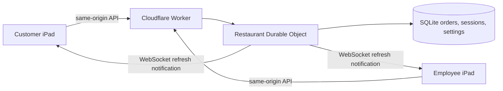

# 🍔 Caleb Bar + Bites

**Good food. Great drinks. Brighter days.**

An iPad-first restaurant ordering PWA with a warm “Barn Neon” design: forest greens, cream panels, the supplied colorful illustrated lakeside logo, a lakeside illustration, soft color accents, and large touch controls. Built with SvelteKit, TypeScript, and a Cloudflare Worker with SQLite-backed Durable Object storage.

This is a local first major working version. It does not take online payments. Read [TESTING.md](TESTING.md) for what was actually verified and the remaining physical-iPad checks. No GitHub operations or deployment were performed.

## 📱 Customer kiosk

Welcome links lead to ordering, the main menu, and the kids menu. A live device-local clock, restaurant status, connection indicator, and optional location-based weather are included. The sidebar stays visible on landscape iPads and becomes a drawer on portrait and narrow screens.

The order flow provides menu viewing, item selection, review, promotion selection, customer name, final total, and submission. Baskets survive menu visits and reloads when local storage is available. Sweet/unsweet tea and kids milk/lemonade have explicit choices. Custom requests require a description.

The kitchen must acknowledge an order before **ORDER SENT!** appears. Customers then see their order number, name, total, live status, and instructions to pay their waiter. **Start another order** resets the completed checkout.

## 👨‍🍳 Employee station

Open **Settings — Employees Only**, or hold the small lower-left emblem for two seconds. A normal tap does not open employee access. The shortcut is only navigation; every protected API verifies the server session.

The control center includes:

- **Live Orders:** item quantities, notes, options, unit and line prices, discounts, zero tax, totals, timestamps, and customer names.
- **Order History:** completed orders, stored persistently on the server.
- **Menu Manager:** toggle available/sold out; updates appear on connected customer stations.
- **Price Manager:** update fixed prices in cents; sent orders keep their original prices.
- **Restaurant Open / Closed:** controls whether the server accepts new orders.
- **Station Management:** name this local device and opt into Screen Wake Lock.
- **Display Settings:** larger item, basket, ticket, and navigation text on this device.
- **System Settings:** enable/disable promotions and inspect menu revision and payment settings.

Orders advance **NEW → ACCEPTED → MAKING → READY → COMPLETED**, one step at a time. Custom items cannot advance until an employee confirms their unit prices. A confirmed custom price immediately updates the customer’s total. Discuss that price with the guest before preparing the request.

Station management is local device configuration, not a remote fleet enrollment system. There is no inventory counting, printing, refund flow, card processor, or payment-ledger feature in this version.

## 📖 Menus & 🌈 3D flip

The main menu uses CSS perspective, two backface-hidden surfaces, and a guarded flip button at the lower right. Reduced-motion preferences switch this to a short fade. The kids menu uses the same undistorted image frame. Browser zoom is not disabled.

The original images were visible in the conversation but unavailable as local image files. **The included PNGs are clearly labeled placeholder menus**, generated from the supplied text. Replace them with the original artwork at these exact paths:

| Your image                             | Replace this file                  |
| -------------------------------------- | ---------------------------------- |
| Caleb’s Bar + Bites Main Menu.png      | `static/menus/main-menu-front.png` |
| Caleb’s Bar + Bites Main Menu Back.png | `static/menus/main-menu-back.png`  |
| Caleb’s Bar + Bites Kids Menu.png      | `static/menus/kids-menu.png`       |

Use the same filenames and genuine PNG files, preferably the original 2:3 portrait images. The app scales with `object-fit: contain`, so other proportions are not stretched. Rebuild after replacement for the production package. Existing installed clients revalidate menu images when online; offline clients retain their last cached images until they reconnect.

After inserting the originals, remove or revise the placeholder notice in `src/lib/components/MenuViewer.svelte`. Image text is separate from order data: changing a PNG does **not** change prices. Update the employee Price Manager or `src/lib/menu.ts` to keep them consistent.

Replace branding at:

- `static/icons/logo.png`: original full-resolution supplied artwork, used in the upper-left branding and lower-left shortcut.
- `static/icons/favicon-48.png`: 48 × 48 PNG browser favicon.
- `static/icons/icon-192.png`: 192 × 192 PWA icon.
- `static/icons/icon-512.png`: 512 × 512 PWA icon.
- `static/icons/apple-touch-icon.png`: 180 × 180 Apple Home Screen icon.
- `static/art/lakeside.svg`: original welcome/weather illustration.

`scripts/assets.mjs` regenerates icons **and overwrites the three placeholder menu PNGs**. Do not run it after replacing the menus unless you intend to recreate placeholders. Run `node scripts/icons.mjs` to regenerate only the branding icons from `static/icons/logo.png`, without changing any menus. The full composition is preserved without cropping. Manifest icons use `purpose: any` to avoid requesting launcher masks that could cut into the illustrated border.

## 💲 Pricing contract

All calculations use integer cents in `src/lib/pricing.ts`; the server recalculates every order with current menu data. Tax is always **$0.00**. A stale menu revision or a client-supplied incorrect total is rejected before acceptance.

The wording of the supplied offers does not specify stacking across separate subsets. This implementation makes that policy explicit: **one promotion type per order**, with repeatable complete groups. “Best single promotion” automatically picks the largest total saving. Guests may choose a different offer or no offer.

- **Sip & Share:** one main-menu bite + one main-menu mocktail saves $3.50, capped at the price of that pair.
- **BOGO:** main-menu mocktails are paired from highest to lowest price; the cheaper or equal drink in each pair is free. An odd leftover stays full price.
- **Ultimate:** two main-menu mocktails + two main-menu bites + one main-menu dessert cost $10. Higher-priced qualifying items are allocated first. A bundle already below $10 is never made more expensive.
- Kids items, drinks, custom requests, and Chef CJ’s Special are not promotion-eligible. This conservative policy is visible at review and can be changed centrally if Caleb chooses a different interpretation.

Main-menu Make Your Own Mocktail is fixed at $3.50. Custom Bite, kids Anything Else, and kids Special Mocktail Request remain `null`-priced until individually confirmed. “Known total” excludes unpriced requests; it is never labeled a final total. Chef CJ’s ingredients remain UNKNOWN.

## 📡 Realtime & persistence



SvelteKit’s static adapter builds the application into `build/index.html` and immutable assets. A Worker serves those assets and forwards `/api/*` to one Durable Object for this restaurant, identified by `RESTAURANT_ID`. This is a coordination boundary for one restaurant; a future multi-location version should route each location to its own object.

SQLite stores orders, a monotonic order counter, idempotency mappings, settings, rate-limit counters, and sessions. Order creation writes the counter, receipt, and request mapping in one synchronous transaction, then broadcasts. `BARN-001`, `BARN-002`, and later numbers stay unique within the restaurant’s retained database. Resetting its database resets this numbering.

WebSockets use Durable Object hibernation. Notifications contain only a refresh event, never customer names or order details. Clients fetch authorized data over HTTP after notifications. Exponential reconnect backoff and a 15-second refresh/heartbeat recover from missed events. A customer sees only orders belonging to its own server session; an authorized employee sees the restaurant’s orders.

A checkout UUID is persisted before sending. After an uncertain response, the basket is frozen for a same-ID retry. **Check before editing** queries the backend for that request before allowing changes. Never erase device storage to “fix” an uncertain order: ask the employee to check receipt first. Session cookies last 12 hours for customers and 8 hours after employee login. If a session expires or cookies are deleted, the employee can still find the order, but that customer browser can no longer automatically recover its details. The original checkout ID is also checked across sessions: retrying it or checking it before editing is blocked with an employee-assistance message when it was already received, preventing a second order under a new session.

There is deliberately no automatic background order submission. An offline basket waits for an explicit retry so the guest remains in control.

## 🔐 Secrets & security

`EMPLOYEE_CODE` is required for employee login. The requested real authorization value is intentionally absent from all source, examples, and client assets. Set it privately on the server. `.dev.vars.example` contains an empty placeholder; `.dev.vars` and `.env*` are ignored. `GIPHY_API_KEY` is optional and server-only.

Security includes server-owned prices, request validation and a 24 KB body limit, same-origin mutation checks, HttpOnly SameSite=Strict cookies (Secure on HTTPS), session rotation on employee login, constant-time comparison of SHA-256 code digests, employee authorization on every protected request, login throttling, per-session order throttling, and parameterized SQL. No API response containing orders or sessions is cached by the service worker.

Tests use a conspicuously synthetic credential in an isolated temporary environment file and temporary database. This fixture is not a real restaurant credential and is not bundled into the client.

This shared-code access model is intended for a small, trusted restaurant station setup. It does not provide individual employee accounts, audit identities, public-abuse protection, or a remote device registry. A public production address should use an appropriate access/rate-control policy for its intended guests. No secrets, Cloudflare accounts, or services were configured by this build.

## ☀️ Optional services

- **Open-Meteo + Browser Geolocation:** location is requested only after the guest taps Use my location. Coordinates are rounded to two decimals and sent directly to Open-Meteo, not stored on the order server. Denied location, network errors, and invalid weather data show friendly fallback text. Verify the provider’s plan/terms for the intended operation.
- **GIPHY:** the Worker proxies an optional G-rated celebration lookup. Missing keys or failed requests yield no GIF; the built-in confirmation always works. Reduced motion suppresses GIF requests.
- **Screen Wake Lock:** employee setting stored per device; requests a lock when visible and reacquires it after returning to the page. Unsupported or denied requests are harmless. It requires browser support and an appropriate secure context.
- **Clock:** uses the device’s real local time/time zone, updated once a second. No location permission is needed.

## 📲 PWA & offline behavior

The manifest sets standalone display, app identity, colors, and PNG icons. Apple touch metadata, safe-area insets, and a zoom-friendly viewport are provided.

The service worker precaches the shell, locally bundled fonts, icons, illustration, and menu images. Immutable build assets are cache-first. Menu images and navigations are network-first with cached fallback. API paths and external requests are never cached. Updates wait for existing tabs to close, avoiding mid-checkout forced reloads. Offline installation from a never-visited site is not possible; the first successful visit must populate the cache.

Browser storage may be cleared by users or the operating system. If storage is blocked, the app explains that the guest must keep the current page open; acknowledged ordering still works. A physical iPad Home Screen installation, pinch zoom, on-screen keyboard, sleep/wake, and real Wi-Fi interruptions still require device testing.

## 🗂️ Project map

| Location                                    | Purpose                                                       |
| ------------------------------------------- | ------------------------------------------------------------- |
| `src/routes/+page.svelte`                   | App shell, navigation, welcome, realtime, receipt, clock      |
| `src/lib/components/OrderFlow.svelte`       | Touch ordering and recoverable checkout                       |
| `src/lib/components/Employee.svelte`        | Auth and employee control center                              |
| `src/lib/components/MenuViewer.svelte`      | Main/kids images and 3D flip                                  |
| `src/lib/components/Weather.svelte`         | Optional weather with graceful failure                        |
| `src/lib/menu.ts`, `pricing.ts`, `types.ts` | Canonical menu, shared money logic, contracts                 |
| `worker/index.ts`                           | Worker API, authentication, SQLite Durable Object, WebSockets |
| `src/service-worker.ts`                     | PWA cache strategy                                            |
| `wrangler.jsonc`                            | Worker assets, binding, migration, compatibility date         |
| `tests/`                                    | Pricing and real-browser/API tests                            |
| `TESTING.md`                                | Test evidence, repairs, and manual checklist                  |
| `LICENSE`                                   | Custom source-available terms; not an OSI license             |

## 🧪 Local development and checks

Requires Node 22.12+ (tested with Node 24) and npm. Dependencies are locked in `package-lock.json`.

```sh
npm install
cp .dev.vars.example .dev.vars
```

Privately edit `.dev.vars` to set `EMPLOYEE_CODE`. Do not put the value in source, screenshots, shared command history, or documentation. Leave GIPHY empty unless needed.

```sh
npm run build
npm run dev
```

Open `http://localhost:5173`. This runs Vite and a local Worker API together; Vite proxies `/api` and WebSockets to port 8787. The initial build supplies Worker static assets. Local SQLite state lives in ignored `.wrangler/state`. The app still runs without an employee code, but employee login explicitly says it is unconfigured.

For production-mode local verification:

```sh
npm run build
npm run preview
```

Open `http://localhost:8787`. This serves the actual static production build and Worker API from the same local runtime. PWA behavior is best checked here rather than the development server.

```sh
npm run types
npm run check
npm run format:check
npm test
npx playwright install chromium webkit
npm run build
npm run test:e2e
```

Browser tests automatically launch an isolated Worker on port 8799, use a synthetic code, and discard their temporary database. They do not touch local restaurant data. Network-failure tests block service workers so interception is consistent; a separate Chromium test verifies the real service worker and offline reload. Playwright’s WebKit service-worker automation is unsupported; it is explicitly excluded and recorded in TESTING.md.

## ☁️ Cloudflare deployment plan

The code is prepared for one Cloudflare Worker with static assets and a SQLite Durable Object. It does not require Pages, Node hosting, a separate API server, or an external database. Wrangler generates runtime/binding types in `worker-configuration.d.ts`.

When Caleb chooses to deploy: validate the build and Worker dry run, set the real `EMPLOYEE_CODE` with Cloudflare’s secret mechanism, optionally set `GIPHY_API_KEY`, deploy the Worker and its v1 Durable Object migration, and open both stations at the same HTTPS workers.dev address or custom domain. Run the two-iPad checklist before using it for real orders. Do not deploy a public employee station with the synthetic test fixture.

No deployment or account mutation was performed. Caleb manages GitHub separately; no GitHub setup is required by the app and none was configured.
